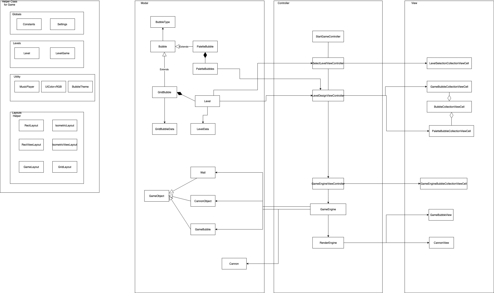

# Duuetblast
==

**Name:** Ang Wei Neng

**Matric No:** A0164178X

**Tutor:** Wang Yanhao

## Tips

1. CS3217's Gitbook is at https://www.gitbook.com/book/cs3217/problem-sets/details. Do visit the Gitbook often, as it contains all things relevant to CS3217. You can also ask questions related to CS3217 there.
2. Take a look at `.gitignore`. It contains rules that ignores the changes in certain files when committing an Xcode project to revision control. (This is taken from https://github.com/github/gitignore/blob/master/Swift.gitignore).
3. A Swiftlint configuration file is provided for you. It is recommended for you to use Swiftlint and follow this configuration. Keep in mind that, ultimately, this tool is only a guideline; some exceptions may be made as long as code quality is not compromised.
4. Do not burn out. Have fun!

### Rules of the game

- Clear bubbles before the time ends to earn points. 

- How to win points:
    - Clear bubbles
        - If only indestructible bubble remains, the game ends and player wins.
    - Finish game before time ends
        - Remaining time will be converted to scores
    - Fire as little bubbles as possible. Each firing of cannon cost 300 points.

- How to not lose:
    - Do not hit chainsaw 
    - Do not allow grid bubbles to cross the gameover line
    - Clear game before time ends

- Special notes:
    - A random bubble will spawn every 20 seconds
    - Chainsaw is in game to prevent you from randomly spamming
    - This is a cooperative game. For multiplayer, you should work with your team to fire less bubbles to clear as many bubbles as possible. 
    - When game has ended, bubbles will freeze in the background. THIS IS A FEATURE. Players can see the last instance of when they end the game. :)

### Problem 1: Cannon Direction

- For single player: Hold anywhere on the screen to adjust cannon direction. Release to fire. Tapping on screen works too. 

- For two player: Same as single player, but tapping zone is restricted to each cannons's half, indicated by the yellow and red tint in the background. 

- Note: Cannon angle can only be between 0 to 180 degrees.

### Problem 2: Upcoming Bubbles

NA.

### Problem 3: Integration

When level is selected, a `LevelGame` object will be passed to the `GameEngineViewController` to run. `GameEngineViewController` will create a `GameEngine` object, which in turn create a `RnderingEngine` to render the game.

Advantages: 
- This method of passing an object around ensure that the state is consistant throughout the gameflow. 
- All the `GameEngineViewController` requires is the `LevelGame` object to init the game, which allows for easy extendability of code if we wish to render the game from another ViewController in the future (i.e. start a randomly generated game, based on random bubbles in the grids).

Disadvantages:
- When playing the game, we need to make a clone copy of `LevelGame` to allow players to restart the game. This cloning cause space inefficiency. However, it's important to note that alternative design that allows for restarting of game will also incur this space penalty. 

### Problem 4.4

My general strategy is, upon a bubble hitting a special bubble, activate that bubble. 

Once bubble is activated, we will activate surrounding bubbles, if they are also special bubbles. This is an action similiar to BFS. 

For example, if we have an isolated bomb bubble on its own, surrounded by normal bubbles, and we have another bomb and star bubble, side by side. When we hit the bomb bubble, the star bubble should be activated. Since the star bubble was activated by a bomb, all bomb bubbles will be destroyed. The isolated bomb bubble will be activated, causing the surrounding normal bubbles to be destroyed. 

Pretty lit. 

### Problem 5

Number of cannon is decided when game is being designed. Once game is saved, there is no changing the number of cannons in the game. 

### Problem 7: Class Diagram

#### Models

1. `Bubble` and `BubbleType` represents Bubbles in the game, whether its from the grid or from the palette. `BubbleType` reflect the type of bubble.
2. `PaletteBubble` and `PaletteBubbles` are models for the palette. `PaletteBubble` represent a single bubble in the palette, and `PaletteBubbles` represent the set of bubbles in the palette.
3. `Level` and `GridBubble` are models that represent the grids in the level design. GridBubble contains the state for a single bubble in the grid, while Level contains the state for all `GridBubble` in the grid. Level should encapsulate the state of the current level design. 
4. `LevelData` and `GridBubbleData` are `NSManagedObject` used for Core Data. Creation of these object result in new entries being created in the database.
5. `GameBubble`, `CannonObject`, `Wall` is used to modal their object. They are subclasses of `GameObject`

#### Controller

1. `LevelDesignViewController` controls the logic in the level design storyboard, particularly the palettecollectionview and the gridcollectionview.
2. `SelectLevelViewController` controls the logic in the level selection storyboard, particularly the collectionview.
3. `GameEngineViewController`: 
    - This is the class that will feed data to the game engine to run. 
    - It is also in charge of modifying collectionView.
4. `GameEngine`: 
    - This is where all the game logic happens, such as 
        - detecting collisions
        - dropping bubbles to grids
        - Generating firing bubbles
        - Moving bubbles in gamearea
        - Performing logic such as destroying if match, drop if unconnected
        - Performing coordination between rendering engine and game objects.
5. `RenderEngine`:
    - In charge of rendering objects in the game area that isn't snapped to any collectionview cell.

#### View
1. `GridLayout` determines the layout of the grid bubbles in level design
2. `BubbleCollectionViewCell` is a collectionviewcell that contains the image to be rendered.
3. `GameBubbleCollectionViewCell` is a collectionviewcell that inherits from `BubbleCollectionViewCell` and performs rendering of the gridbubble in level design view.
4. `PaletteBubbleCollectionViewCell` is a collectionviewcell that inherits from `BubbleCollectionViewCell` and performs rendering of the palette in level design view.
5. `LevelSelectionCollectionViewCell` is a collectionviewcell that renders the table in level selection.
6. `GameEngineBubbleCollectionViewCell` is a collectionviewcell that renders the bubble in game.
7. `GameBubbleView` is a view for the bubbles in the game
8. `CannonView` is a view for the cannon

#### Others
1. `Constants` Store all constant value in the game
2. `Settings` In charge of setting music and images of the game
3. `Level` and `LevelGame` models the levels in the game. Used by `LevelDesignViewController` and `GameEngineViewController`
4. `MusicPlayer` is used to play music logic
5. `BubbleTheme` is used to generate file name of bubbles based on theme. Game currently only have one theme.
6. `GameLayout`, `RectLayout`, `IsometricLayout` is used to determine layout logic such as nearest neighbours.
7. `GridLayout`, `RectViewLayout` and `IsometricViewLayout` is used to render the arrangement of the collectionview for rect and isometric arrangement.

### Problem 8: Testing

#### Black-box testing

- Test background image 
    - There should be a background image in the game.

#### Assume that user is in start menu
- There should be a "load level" and "create level" button
- When "Load Level" button is pressed, user should enter level selector page
- When "Create Level" button is pressed, user will have a choice to create a rectangle grid or isometric grid layout, or simply cancel the alert. When user select rectangle or isometric grid layout, they should enter level designer page.

#### Assume that user is in level designer
- Test by eyeballing the layout 
    - There should be a grid on the screen, with 12 columns and 9 rows. For isometric layout, there should be 12 or 11 columns in each row, alternating.
    - There should be a palette at the bottom of the screen, scrollable horizontally.
    - There should be 3 buttons at the bottom of the screen, `back`, `start` and `save`.
    - Approx in the center of the screen, there should be a time showing how much time was selected. There is also two buttons.
        - Select number of players allow user to choose how many cannon will be in the game
        - The `+` and `-` button adjust the time, in steps of 10, up to a max of 200 and a min of 20
- Test that grid bubbles can be coloured with palette.
    1. Create a new game by pressing `New Level` in the level selection page. 
    2. Select a color in the palette. By default, no color should be selected.
    3. Tap a grid bubble. That grid bubble color should change to the color of the selected palette bubble. 
    4. If erase bubble is selected, the grid bubble will reset to empty.
- Test gestures:
    - Single tap of palette:
        1. Tap a palette bubble
        2. If palette bubble is not selected, that palette bubble should now have a solid border with 100% opacity. Other bubbles should only have 50% opacity with no border. 
        3. If palette bubble was selected, the tap should de-select it, resulting in no palette bubbles being selected.
        4. Note that magnet is a normal bubble, hence it will appear in the cycle.
    - Long press:
        1. Long-press a grid bubble that is not empty (grey).
        2. The bubble should become empty (grey).
    - Panning:
        1. Select a color in the palette.
        2. Pan on the grid bubbles.
        3. Bubbles that was panned should turn into the color of the selected palette bubble.
    - Single-tap to cycle color
        1. Ensure that no palette bubble is selected.
        2. Tap on a grid bubble that is not empty (grey).
        3. Color should change based on the order: red -> blue -> orange -> green.
- Test buttons:
    - Test `back` button
        1. Confirmation alert should appear, warning user that any unsaved data will be deleted. 
        2. View where user came from should appear.
    - Test `save` button
        1. Press save. 
        2. Type name of level that you want to call the level.
        3. Grid must fuifill some rules:
            - If there is no bubbles in the top row, saving will not occur.
            - If grid is empty, saving will not occur
            - If grid only contains indestructible bubbles
        4. If name of level already exist, a confirmation alert will appear. 
            1. If confirm is press, previous level with same name will be over-ridden
            2. If cancel is pressed, no further action will happen.
        5. Prefix and suffix spaces will be removed from name for sanitisation.
            - If length of name is not betweeen 3 and 20 (inclusive), saving will fail.
        6. Saving confirmation will appear if saving is successful.
    - Test start button:
        1. Grid must fuifill some rules:
                - If there is no bubbles in the top row, saving will not occur.
                - If grid is empty, saving will not occur
                - If grid only contains indestructible bubbles
        2. Game should start if rules are fufilled.

#### Assume that user is in level selector
- Test deleting of level
    1. On the level cell that you wish to delete, press the dustbin button.
    2. Press confirm to delete
        - If cancel is pressed, deletion will not occur
    3. Level will be deleted, cell should disappear from view
- Test start game
    1. Press on the cell. Game will start
- Test buttons:
    - BACK button:
        - Should go back to start menu
    - Create level
        - Option to create rect or isometric grid
        - On selection, should go to level designer view
- Test cell info
    - Cell on the view should contain the following info:
        - Screenshot of level
        - Name
        - Highscore
        - Time
        - Number of cannons in the game
    - Start game in cell. Game that ran should follow the above screenshot, time, number of cannons and highscore.

#### Assume that user is in game
- Test firing bubble:
    - Tap on any point above or at the same height as the cannon, from 0 to 180 degress of the cannon, and in the gameplay area. Bubble should fly towards that position
- Test firing cannon angle
    - Pan on any position in the grid, cannon should change position based the pan position. 
    - For two players, testing of a cannon should be done on each player view. 
- Test colliding bubbles:
    - Fire two bubbles from two cannon at any angle such that their path collides. 
    - Bubble should realistically bounce off.
    - Note that there is a possibility that bubble can move downwards and disappear out of the game. (Not a feature or bug, just physics)
- Test cannon not being able to fire when collided with ball:
    - Fire a ball horizontally. Cannon should not release bubble to ensure that no two balls overlaps. 
- Test bubbles being attached to the top wall:
    - Fire a bubble upwards.
    - Bubble should snap to a grid on the frist row.
- Test game-over logic:
    - Fire bubble into the game area until a bubble snaps on a grid below the dotted line in the game.
    - All bubbles, moving or stationary, should fall.
    - No more bubbles should be allowed to be fired. 
- Test bubbles that is not connected to fall:
    - Set up game area such that bubbles will be unconnected. This can be done by firing bubbles to the game area.
    - Bubbles that is unconnected should fall.
- Test bubbles disappearing on matchThree:
    - Fire bubbles into the game such that there at 3 bubbles of the same color in the game connected. 
    - The bubbles does not need to be touching all other bubbles simultaneously. As long as there is a path from one bubble to another, where the path are of the same bubble color, those bubbles connected should drop.
- Test powerups
    - Star
        - Create a grid with a star. Fire a bubble of any color at the star
        - All bubbles of that color should disappear, and any unattached bubble should fall
    - Bomb
        - All neighbouring bubbles should disappear when a firing bubble hits a bomb
    - Lightning
        - All bubbles of the same row should disappear when a firing bubble hits a lightning bubble.
    - Indestructible
        - This bubble should never be fired, hence matchThree can never occur with Indestructible
    - Chaining of powerups
        - See problem 4.4 for testing
- Test restart logic:
    - Press restart and confirm restart
    - All bubbles should fall and be removed from the game.
- Test falling bubbles not being able to interact with moving bubbles:
    - Set up game area such that bubbles will be unconnected. This can be done by firing bubbles to the game area.
    - While bubbles is falling, firing bubbles into the game such that firing bubbles and falling bubbles will collide. There should not be any interaction between them. 
- Test bounding of bubbles off vertical walls:
    - Fire a bubble at a wall.
    - Bubble should bounce off realistically. 
- Test grid layout
    - If rect grid game was selected, grid should be a rect layout. Same for isometric layout.
    - Check that when bubble drops on the grid, it follows the correct layout. 
- Test number of cannon
    - Start a game with one player, there should be one cannon in the game.
    - Start a game with two player, there should be two cannons in the game.

### Glass-box testing

#### LevelDesign & LevelSelector
- `LevelDesignViewController`
    - `loadGrid`
        1. Precondition: `LevelData` is in database.
        2. if `levelName` is not in `LevelData`, grid should not be updated. 
        3. if `levelName` is in `LevelData`, grid should be updated.
        4. Alert should pop up indicating if load was successful or not.
    - `presentLevelSelector()`
        1. When this function is called, level selector storyboard should appear.
    - `getHeightOfGameArea()`
        - Should return the height of collectionview
- `SelectLevelViewController`
    - loadSavedLevel()
        - UI Should show all levels that was previously saved
- `Level`
    - `getBubbleTypeAtIndex` 
        - should get the bubble type at the index. 
    - `setBubbleTypeAtIndex`
        - After function is called, check if bubble type at the index is indeed set correctly.
    - `setBubbleTypeAtIndex`
        - After function is called, check if bubble type at the index is indeed set correctly.
    - `cycleTypeAtIndex`
        - Let number of playable bubbles be n. Calling the cycle n times should cause bubble at the `index` to be of n different bubble types. 
        - `eraseAllBubbles`
            - All bubbles should have a bubbleType of .empty
        - `isEmpty`
            - Create 2 levels, one with empty grids and one without
                - If grid is empty, return true
                - If grid is not empty, return false. 
- `GridBubble`
    - `cycleNextColor`
        - Let number of playable bubbles be n. Calling the cycle n times should cause bubble to be of n different bubble types. 
    - `eraseBubble`
        - Bubble should now be of `BubbleType` `empty`. 
    - `togglePaletteBubble`
        - `isSelected` value at `index` of `paletteBubbles` should be flipped.
- `Bubble`
    - `imageUrl`
        - Check that `Bubble` of `BubbleType` .red has `imageUrl` of "bubble-red.png"
        - Check with other known `BubbleType`
- `BubbleType`
    - `imageUrl`
        - Check that `BubbleType` .red has `imageUrl` of "bubble-red.png"
        - Check with other known `BubbleType`

#### GameEngine Test
- `GameEngineViewController`
    - `firingPosition`
        - firingPosition should return a coordinate that is at the bottom center of the gameplay area.
- `RenderEngine`
    - `renderBubble` 
        - Given a bubble type, a bubble of that type should be rendered at the firing point.
        - Bubble should be inserted into `gameBubblesView`. 
    - `renderFallingBubble`
        - Input bubble should be rendered at input position.
        - Bubble should be inserted into `gameBubblesView` if it was not inserted before. 
    - `rerenderBubble`
        - `gameBubblesView` should be updated to hold the bubble new position. 
    - `moveBubble`
        - `gameBubblesView` should be updated with the bubble new position
    - `setAngle`
        - Ensure that angle was indeed set to the input.
    - Length of `cannonsViewMap` should be equal to number of players in the game. 
- `GameEngine`
    - `fireBubble`
        - Check that angle must be upwards of game. For this game, upwards is considered 0 degrees. Hence, new angle set must be between -pi / 2 to pi / 2, or no execution should occur.
        - If angle is correct, ensure that cannon is set to the respective angle, and cannon.fireBubble() is executed. 
    - `generateFiringBubble`
        - Check that if gameover, nothing should happen
        - Check that if not gameover, bubble should be loaded to cannon, and `gameBubbles` should have a bubble inserted. 
    - `moveBubble`
        - Given a bubble input, bubble position should be updated based on its velocity and initial position. 
    - `collidedBubble`
        - Given a bubble input, get the first bubble in the game that is colliding with the input bubble, and isnt falling or was the last collided bubble.
    - `movingFiringBubble`
        - Given the bubble state, perform action:
            - If bubble is falling, just check whether it is out of bounds before derendering the ball from the view
            - If bubble is moving, check for any collision
            - if bubble is stationary, terminate the function
            - if bubble is in cannon, and bubble is moving, the app should crash as this makes no sense.
        - Move bubble based on its velocity and initial position.
    - `restartEngine()`
        - deregister all bubbles in the game with `falling` movementType. 
        - gameBubbles should be empty at end of function
        - gameplayBubbles should be empty at end of function
        - A new bubble should be generated at the firing position.
    - `setupLevel`
        - When this function is ran, the following should happen:
            - renderEngine should render a chainsaw bubble
        - All non-attached bubbles should fall.
    - `activatePower(collidedBubble, collidee)`
        - If collidedBubble is a normal bubble, do nothing
        - Else, collidedbubble power should be activated
        - Switch collidedBubble.bubbleType
            - case: .star
                - bubbles in gameBubbles with the same type should disappear
            - case: .bomb
                - Bubbles that are of neighbouring index of collidee should explode
            - case: .indestructible
                - Ensure that indestructible bubble will not be spawn, hence matchThree cant work
            - case: .lightning:
                - Bubbles that are in same row of lightning bubble should explode
        - In those cases, if there are unattached bubbles, they should be removed from gameBubbles set.
        - Test for chaining of power.
            - Provide test cases of gameBubbles to check that chaining works. Problem 4.4 shows the UI testing method, but it can easily be translated to glass-box testing.
    - Test grid layout
        - For rect grid, there should be 12 bubbles in each row, and there should be 9 rows.
            - We can check this using `getRowIndexes`
        - For isometric grid, there should be alternating 12 and 11 bubbles in each row, with 9 rows.
    - Test neighbours
        - Depending on isometric or rect grid, we can test at critical indexes. i.e. start and end of row one and two, and out of bound indexes.
    - Test Multiple Cannon
        - length of `cannons` should be equal to the number of players in the game. 

- Global classes
    - `UIViewController+Render`
        - When `renderChildController(child)` is called, `viewController` should have a new child and `child`'s parent should be `viewController`
        - When `derenderChildController(_ moveToParent: Bool = true)` is called, viewController should be derendered. if moveToParent is True, parent will appear and vice versa.

### Problem 9: The Bells & Whistles

- Cannon has animation!!
- Music and sound effects
- Obviously multiplayer mode since it is required
- More special bubbles
    - Chainsaw: Always in game. On collision with chainsaw -> Game over.
    - Magnet: Currently does nothing. (i.e. Normal bubble)
    - Random (Question mark icon): On collision, becomes a random power-up.
    - Rubbish Bin: On collision, both bin and bubble disappear.
    - Rocket: This is released by the cannon with 10% probability. On firing, drop anything on its path due to it being a rocket. 
    - Nice bubble assets
- Score
    - With cool scoring algorithms
- Highscore system
- Timer with configurable settings
- Very very very nice UI (took me 3 days * 14h)
    - SelectLevel button in Start Menu has animation
    - Time and score can be seen while playing the game
        - When time is below 20, time text becomes orange
        - When time is below 5, time textbecomes red
        - When highscore is broken, score text become gold colour. 
- Nice background
- Preview level screenshot from `LevelSelector`
- End game screen
    - Show if broke highscore or not.
- Allow deletion of levels!
- Note that editing of levels is trival, but I did not implement it as it doesn't make sense for one guy to create a level and another guy to edit it, although my PS4 supports that. Please don't deduct marks here. 
- Alot of nice popups for user confirmation

### Problem 10: Final Reflection

> Comment on the original design of your MVC architecture and also on the design of your game engine. Is it possible to further improve the design/architecture? If so, how? If not, why not?

1. Controller is too heavy.
    - Out of the M, V and C, for my code, the controller did the most work. This is quite unproportionate. In fact, for controllers such as `GameEngine`, I had to break the code into 4 files just for the code to be cleaner. One way to improve is to delegate the work to other classes. Due to time constrain, I could only refactor the code into 4 file of the same class. With more time, those 4 files could become 4 classes instead. 
2. While I attempted to decouple the model and the view, I am still not confident that the modals in my code did not talk to the view. 
3. For some modal that can be designed to be reusable, I did not plan ahead, and ended up creating classes that can be combined (Bubble, GameObject, and GridBubbles). 
4. One interesting choice I had to make was with the music player. I could either make every controller play their own music, or have a global class that stores all musics that is being played. I chose the second option because less code will need to be written and I was under time constrain. However, the advantages of each controller having to play their own music is that I can guarantee that when the controller goes out of view, there wont be any background music. For my case, I could only allow instantaneous music (cannon boom, bomb explosion sound, which are 1second) to guarantee that background music won't be played. Based on this experience, I felt that a functional approach to MVC will be alot cleaner. (i.e. We write functionals that are only dependant on the inputs. Only when we need to mutate the state then we have a function to mutate the object). Because I did not do this, I had a lot of dependancy bugs which wasted ALOT of my time. 
5. There was a number of repeatitive code in each controller, which I had to 'copy and paste' since they are in different controller. This shows the poor design that I had in my code. I could have written more delegates to fix this issue, but 1. I'm still not familiar with delegate patterns and 2. I was too deep in the shit to fix my code. 
6. A lot of my time for PS5 was spent on UI. However, I noticed that the size of my code for Views are quite low. Most of the code ended up in the controller. This also shows bad planning as I had to recode my controllers just to inject new view. 
7. All in all, the main issue I had was that I didn't plan well, hence when new requirements comes in, I had to basically rewrite my code to allow for the new feature. Probably a good lesson to learn at this stage, since there isn't any PS6 to screw me up. However, for the project, it is extremely important to plan so that there won't be any issues in the end. 

## Note: App works best on iPad 11". There is no guarantee that app will work on other devices.